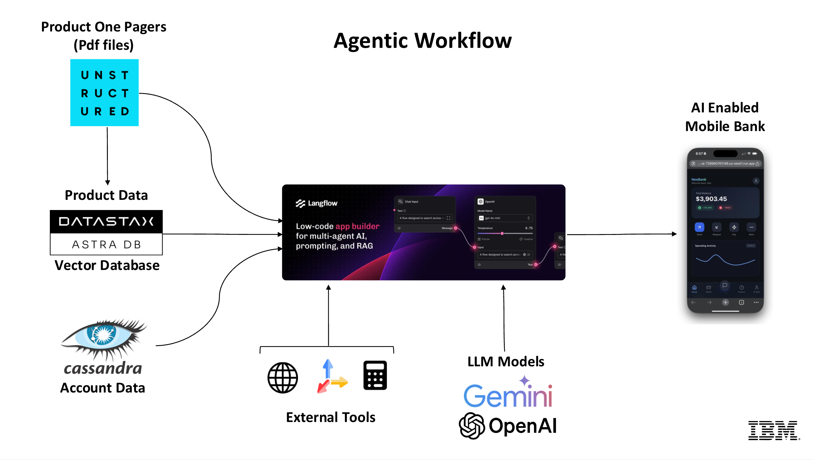

# AI Mobile Bank 

This project is a AI-powered mobile banking demo application. It consists of a Python FastAPI backend connecting to DataStax Astra DB and a React frontend.



## Prerequisites

*   **Node.js** (v18+)
*   **Python** (v3.11+)
*   **Astra DB Account**: You need two databases on Astra Cloud:
    1.  **Cassandra Database**: For banking transactions.
    2.  **Vector Database**: For AI/RAG features (if applicable).

## Setup Instructions

### 1. Database Setup (Astra DB)

1.  **Cassandra Database**:
    *   Create a standard Cassandra database.
    *   Download the **Secure Connect Bundle** (zip file).
    *   Create an **Application Token** with `Database Administrator` role (Client ID & Client Secret).

### 2. Quick Start (Recommended)

The project includes an interactive setup script that handles dependencies, configuration, and database initialization for both backend and frontend.

1.  **Place your Secure Connect Bundle** in the `backend/` directory.

2.  **Run the Setup Script**:
    ```bash
    ./setup.sh
    ```
    *   The script will prompt you for your Astra DB credentials if they are not already configured.
    *   It will install all Python and Node.js dependencies.
    *   It will initialize the database schema and insert mock transaction data.

3.  **Start the Application**:
    Open two terminal windows:

    **Terminal 1 (Backend):**
    ```bash
    cd backend
    source venv/bin/activate
    python api.py
    ```

    **Terminal 2 (Frontend):**
    ```bash
    cd frontend
    npm run dev
    ```
    The app will be available at `http://localhost:3000`.

### 3. Manual Setup

If you prefer to set up manually:

#### Backend

1.  Navigate to `backend/`.
2.  Create `env_vars.yaml` with your credentials (see `env_vars.yaml.local` for example).
3.  Create a virtual environment and install requirements: `pip install -r requirements.txt`.
4.  Run `python update_schema.py` and `python insert_transactions.py`.
5.  Start server: `python api.py`.

#### Frontend

1.  Navigate to `frontend/`.
2.  Create `.env.local` (copy from `.env.local.example`).
3.  Install dependencies: `npm install`.
4.  Start dev server: `npm run dev`.

## Architecture

*   **Backend**: FastAPI (Python), `cassandra-driver` for Astra DB connection.
*   **Frontend**: React, Tailwind CSS, Recharts, Lucide React.
*   **Database**: DataStax Astra DB (Serverless Cassandra).

## Troubleshooting

*   **500 Internal Server Error on API**: Ensure `update_schema.py` has been run to add the `transaction_timestamp` column.
*   **Connection Failed**: Verify `SECURE_CONNECT_BUNDLE` path in `env_vars.yaml` matches the actual filename in `backend/`.
